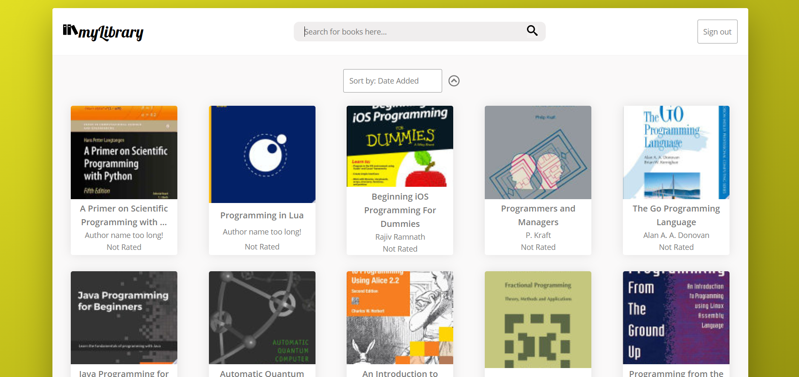
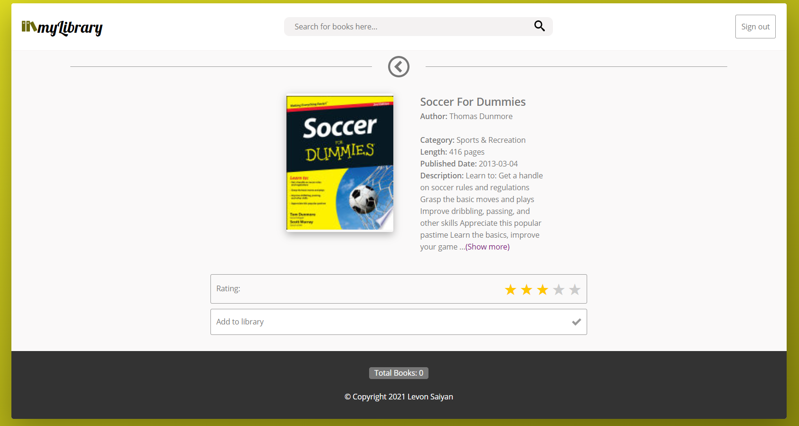

"# my-library"

My Library

An app for managing your digital library designed specifically to work with the Google Books API.
This project was built to demnonstrate my end development skills using React.

// Installation //

Clone down this repository. You will need node and npm installed globally on your machine.

Install dependencies :
npm install

To Start Server:
npm start

To Visit App:
localhost:3000

// Usage //

This app is very easy to use. You can log in through your Google account or as a guest. Books can be added to your library and rated.
You can also sort your books based on a few parameters.

Created by Levon Saiyan.
